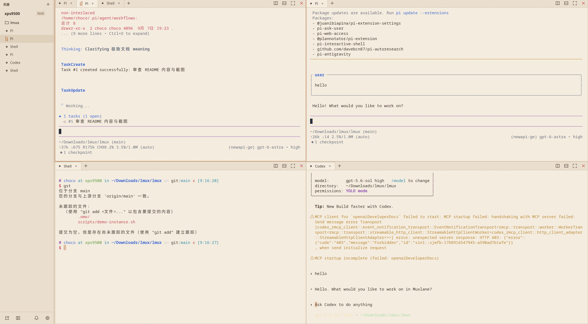

# Muxlane

**原生多 Agent 终端工作台。** 将本地与 SSH 远端的项目、终端和 AI Coding Agent 会话集中在一个界面里，让多个任务并排运行，随时查看进度、切换上下文和处理通知。

Muxlane 使用 Rust + GPUI 构建，面向 Linux 与 macOS。

## 按机器和项目管理会话

侧栏按 **机器 → 项目 → 会话** 组织工作内容，本地与远端项目统一展示。展开项目即可查看其中的会话，点击会话切换到对应终端；终端标题可随正在运行的程序动态更新。

项目对应实际目录。添加项目时，若目录不存在，应用可在确认后创建；远端目录创建需要对应版本的远端服务支持。本机安装了 VS Code、Zed 或 IntelliJ IDEA 时，本地项目的右键菜单会显示对应的「在 … 中打开」入口。支持 PATH 中的编辑器命令、macOS 应用包、Flatpak，以及 IntelliJ IDEA 的默认 JetBrains Toolbox 启动脚本；Linux 上同时存在 `zeditor` 和 `zed` 时优先使用 `zeditor`。

## 在同一工作台运行多个 Agent

通过命令面板选择项目和终端预设，启动 Shell、Claude Code、Codex、Pi、OpenCode、Qwen 等会话。多个 Agent 可以同时运行在不同标签页、分屏或独立窗口中。

- **快速创建会话**：按 `Win / Super + K`（Linux）或 `Command + K`（macOS）打开命令面板。
- **默认终端预设**：可将 Shell 或常用 Agent 设为默认，用于新建标签页和分屏。
- **Shell 中自动识别**：在普通 Shell 会话里手动运行 Pi、Codex、Claude Code 等命令时，会话会自动切换为对应 Agent 的标题、状态和通知；Agent 退出后恢复为 Shell。识别依据终端前台进程，不会因为输出中出现命令名而误判。
- **本地与远端运行**：本地会话使用本机环境，远端会话在对应远端机器执行。

Muxlane 提供会话管理和终端界面。各 Agent CLI 及其登录配置需在实际运行会话的机器上准备。macOS 上从启动台打开应用时，会读取登录 Shell 的 PATH 并补充 nvm 下的 Node 工具目录，用于检测和启动通过 npm 安装的 Agent。

## 标签页与自由分屏

同一窗格可容纳多个标签页，也可以向右或向下分屏，按任务需要继续嵌套布局。

- **标签页**：点击终端标签栏的 `＋` 新建默认终端，保持当前分屏结构。
- **递归分屏**：组合左右、上下分屏，让代码修改、测试和其他 Agent 会话并排显示。
- **拖动调整**：拖动分割线改变窗格比例，适应当前任务需要。
- **专注模式**：将单个窗格最大化，处理完后恢复原有布局。
- **布局记忆**：工作区保存布局与比例，关闭窗格时自动合并空出的布局层级。

## 将会话弹出为独立窗口

会话可以留在主窗口中平铺，也可以弹出为真正的系统窗口，由窗口管理器负责移动、缩放、最大化、跨屏和 Alt-Tab 切换。

在侧栏会话或终端标签页的右键菜单中选择「弹出到独立窗口」，即可将该会话移出主窗口内容区。侧栏保留弹出标记，点击可置顶对应窗口。也支持一次性弹出或收回所有机器、所有项目的会话。

**关闭独立窗口会将会话收回主窗口，后台任务继续运行。** 窗口位置、大小和弹出状态随工作区保存，方便恢复多屏工作环境。

## 集中查看任务状态与通知

通过 Agent Hook 接收执行中、等待输入、任务完成等状态，减少逐个检查终端的需要。

- **状态提示**：侧栏通知入口显示未读计数与任务活动状态。
- **通知中心**：集中查看任务状态变化、结果和相对时间，点击跳转到对应会话。
- **桌面提醒**：在设置中控制桌面通知与声音。
- **远端已读同步**：支持该能力的远端版本会保存结果已读状态，客户端重启后仍保留；旧版远端降级为当前客户端会话内已读。

已集成 Claude、Codex、OpenCode、Pi 等 Hook，具体状态取决于各 Agent 支持的事件。Hook 报告脚本需要 Node.js，也可通过 `MUXLANE_HOOKS=off` 禁用。

## 退出后保留后台会话

本地会话由独立的 tmux 服务承载。退出 Muxlane 桌面应用时，后台会话可以继续运行；再次打开时恢复仍存活的会话，并回填部分终端输出。

| 操作 | 会话行为 |
| :--- | :--- |
| 退出桌面应用 | 分离终端客户端，后台会话可继续运行 |
| 关闭弹出窗口 | 收回主窗口，会话继续运行 |
| 在主窗口关闭会话标签页 | 终止对应会话 |
| 移除远程机器连接 | 移除本地连接记录，不终止远端会话 |

会话保留依赖 tmux 和进程仍然存活，不能保证机器重启后的任务恢复。终端回放容量有限，也不保证完整保留断线期间的全部输出。

## 连接 SSH 远程工作区

通过 SSH 连接远端 Muxlane 服务，在本机工作台管理远端项目与会话。支持 SSH config 别名、指定私钥和密码认证；需要已有的 SSH 网络可达性与认证环境。

- **环境探测**：区分远端离线、服务未启动、程序未安装等状态。
- **确认后部署**：在兼容环境中，经确认上传 Muxlane 并启动远端服务。
- **无桌面运行**：远端可使用 Headless 模式运行服务，无需打开应用窗口。
- **断线与重连**：离线时保留缓存快照和布局，便于恢复工作区。
- **直接连接**：每条连接读取目标实例的项目与会话，不递归发现它连接的其他机器。

自动部署要求二进制与远端的操作系统、CPU 架构和动态库兼容；Headless 仍需满足运行依赖。macOS 默认缺少密码认证和自动部署路径所需的部分工具，建议使用 SSH config / 密钥并预先准备远端服务。

## 原生终端与输入体验

终端由 `portable-pty` 与 `alacritty_terminal` 驱动，支持日常 Shell 操作和全屏 TUI 程序。

- **终端色彩**：支持 ANSI 256 色与 TrueColor。
- **中文与输入法**：处理 CJK 双宽字符、结合符，以及 IME 组合与提交。
- **滚动与复制**：支持历史滚动，文本选区松开后复制到剪贴板。
- **鼠标交互**：向启用鼠标报告的终端程序转发点击和滚轮；按住 `Shift` 拖拽可强制选择本地文本。
- **个性化设置**：支持自定义 Shell、默认终端预设，以及新建、切换、关闭会话和分屏等动作的快捷键。

字体、输入法和渲染效果取决于操作系统与桌面环境。当前面向 Linux（X11 / Wayland）和 macOS，不发布 Windows 版本；会话运行依赖 tmux。

## 开源许可

Muxlane 使用 [MIT 许可证](LICENSE)。欢迎通过 [Issues](https://github.com/chocotan/muxlane/issues) 反馈问题与建议，或提交 PR。
